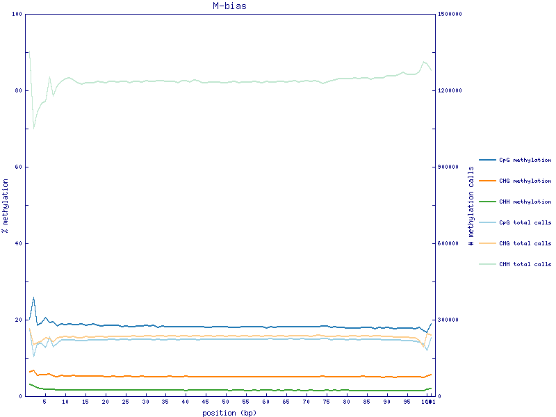
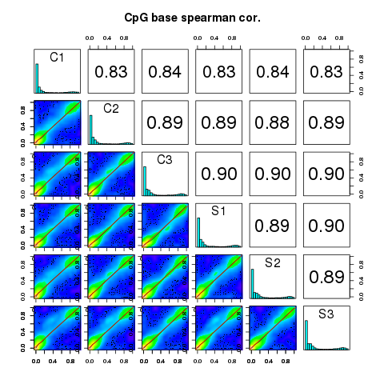
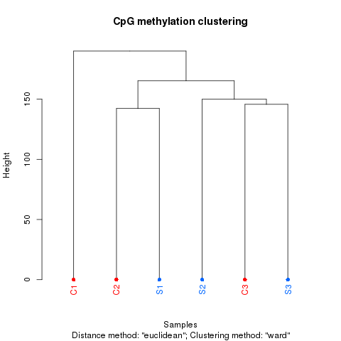

```{css, echo=FALSE}
pre code {
white-space: pre !important;
overflow-x: scroll !important;
word-break: keep-all !important;
word-wrap: initial !important;
}
```
<!--
## Compile from command-line
Rscript -e "rmarkdown::render('systemPipeMethylseq.Rmd', c('BiocStyle::html_document'), clean=F); knitr::knit('systemPipeMethylseq.Rmd', tangle=TRUE)"; Rscript ../md2jekyll.R systemPipeMethylseq.knit.md 2; Rscript -e "rmarkdown::render('systemPipeMethylseq.Rmd', c('BiocStyle::pdf_document'))" -->

```{r style, echo = FALSE, results = 'asis'}
BiocStyle::markdown()
options(width=60, max.print=1000)
knitr::opts_chunk$set(
    eval=as.logical(Sys.getenv("KNITR_EVAL", "TRUE")),
    cache=as.logical(Sys.getenv("KNITR_CACHE", "TRUE")), 
    tidy.opts=list(width.cutoff=60), tidy=TRUE)
```

```{r setup, echo=FALSE, message=FALSE, warning=FALSE}
suppressPackageStartupMessages({
    library(systemPipeR)
    library(batchtools)
    library(BiocParallel)
    library(Biostrings)
    library(Rsamtools)
    library(GenomicRanges)
    library(ggplot2)
    library(GenomicAlignments)
    library(ShortRead)
    library(ape)
})
```

# Introduction

Users want to provide here background information about the design of their Methyl-Seq project.

Cytosine methylation is one of the important epigenetic mechanism to control gene expression. 
The epigenetic modification is has been associated with many biological processes, including various diseases and normal development, as well. One of the techniques for profiling genome-wide DNA methylation is based on sodium bisulfite, followed by NGS (BS-seq). Whole-genome bisulfite sequencing (WGBS) provides global coverage at a single-base resolution. This protocol effectively converts on-methylated cytosines into uracils, while methylated cytosines are preserved. Eventually, uracils are converts into thymines during the PCR amplification cycles.

<!-- Add some introduction about the sequencing protocol... -->

# Sample definitions and environment settings

## Environment settings and input data

Typically, the user wants to record here the sources and versions of the
reference genome sequence along with the corresponding annotations. In
the provided sample data set all data inputs are stored in a `data`
subdirectory and all results will be written to a separate `results` directory,
while the `systemPipeMethylseq.Rmd` script and the `targets` file are expected to be located in the parent
directory. The R session is expected to run from this parent directory.

The chosen data set [SRP097911](https://www.ncbi.nlm.nih.gov/sra/?term=SRP097911)
contains  single-end (SE) read sets from *Arabidposis thaliana*
[@Ganguly2017-ur]. 

<!--
TODO: remover this part and add the new explain form the new genWorkenvir function)
-->

The following loads one of the available NGS workflow templates (here Methyl-Seq)
into the user's current working directory. At the moment, the package includes
workflow templates for RNA-Seq, ChIP-Seq, VAR-Seq, Ribo-Seq and Methyl-Seq. Templates for
additional NGS applications will be provided in the future.

```{r genRna_workflow, eval=FALSE}
library(systemPipeRdata)
genWorkenvir(workflow=NULL, package_repo="systemPipeR/systemPipeMethylseq")
setwd("systemPipeMethylseq")
```

Now open the R markdown script `systemPipeMethylseq.Rmd`in your R IDE (_e.g._ vim-r or RStudio) and 
run the workflow as outlined below. 

## Required packages and resources

The `systemPipeR` package needs to be loaded to perform the analysis steps shown in
this report [@Girke2014-oy].
<!--
TODO: add new package dependence in the Description, and namespace
-->

```{r load_systempiper, eval=TRUE}
library(systemPipeR)
```

## Experiment definition provided by `targets` file

The `targets` file defines all FASTQ files and sample comparisons of the analysis workflow.

```{r load_targets, eval=TRUE}
targetspath <- system.file("extdata", "targets.txt", package="systemPipeR")
targets <- read.delim(targetspath, comment.char = "#")
targets[1:4,1:4]
```

# Read preprocessing

## Read quality filtering and trimming

The function `preprocessReads` allows to apply predefined or custom
read preprocessing functions to all FASTQ files referenced in a
`SYSargs2` container, such as quality filtering or adapter trimming
routines. The paths to the resulting output FASTQ files are stored in the
`output` slot of the `SYSargs2` object. The following example performs adapter trimming with
the `trimLRPatterns` function from the `Biostrings` package.
After the trimming step a new targets file is generated (here
`targets_trim.txt`) containing the paths to the trimmed FASTQ files.
The new targets file can be used for the next workflow step with an updated
`SYSargs2` instance, _e.g._ running the NGS alignments using the
trimmed FASTQ files.

Construct _`SYSargs2`_ object from _`cwl`_ and _`yml`_ param and _`targets`_ files.

```{r construct_SYSargs2_trim-se, eval=FALSE}
dir_path <- system.file("extdata/cwl/preprocessReads/trim-se", package="systemPipeR")
trim <- loadWorkflow(targets=targetspath, wf_file="trim-se.cwl", input_file="trim-se.yml", dir_path=dir_path)
trim <- renderWF(trim, inputvars=c(FileName="_FASTQ_PATH1_", SampleName="_SampleName_"))
trim
output(trim)[1:2]
```

```{r preprocessing, eval=FALSE}
preprocessReads(args=trim, Fct="trimLRPatterns(Rpattern='GCCCGGGTAA', 
                subject=fq)", batchsize=100000, overwrite=TRUE, compress=TRUE)
writeTargetsout(x=trim, file="targets_trim.txt", step = 1, 
                new_col = "FileName1", new_col_output_index = 1, overwrite = TRUE)
```

## FASTQ quality report

The following `seeFastq` and `seeFastqPlot` functions generate and plot a series of useful 
quality statistics for a set of FASTQ files including per cycle quality box
plots, base proportions, base-level quality trends, relative k-mer
diversity, length and occurrence distribution of reads, number of reads
above quality cutoffs and mean quality distribution. The results are
written to a PDF file named `fastqReport.pdf`.

```{r fastq_report, eval=FALSE}
fqlist <- seeFastq(fastq=infile1(trim), batchsize=10000, klength=8)
pdf("./results/fastqReport.pdf", height=18, width=4*length(fqlist))
seeFastqPlot(fqlist)
dev.off()
``` 


<div align="center">Figure 1: FASTQ quality report for 6 samples before filtering.</div></br>

# Alignments

## Read mapping with `Bowtie/Bismark` 

The NGS reads of this project will be aligned against the reference
genome sequence using `Bowtie/Bismark` [@Langmead2012-bs, @Krueger2011-uu] in both 
interactive job submissions and batch submissions to queuing systems of clusters 
using the _`systemPipeR's`_ new CWL command-line interface.

<!-- 
Get better explanation
-->
Bisulfite sequencing aligners, like Bismark @Krueger2011-uu] are based
on three-letter algorithm. Which converts all Cs in the
reference genome and the read into Ts, and thus, standard
aligners with lower mappability can be adopted due to
reduced sequence complexity. 

Build _`Bismark`_ index.

```{r bismark_index, eval=FALSE}
dir_path <- "param/cwl/bismark/bismark_idx/"
idx <- loadWorkflow(targets=NULL, wf_file="bismark-index.cwl", input_file="bismark-index.yml", dir_path=dir_path)
idx <- renderWF(idx)
idx
cmdlist(idx)

## Run in single machine
runCommandline(idx, make_bam = FALSE)
```

The parameter settings of the aligner are defined in the `bismark-mapping.cwl` 
and `bismark-mapping.yml` files. The following shows how to construct the 
corresponding *SYSargs2* object, here *args*.

```{r bismark-mapping, eval=FALSE}
dir_path <- "param/cwl/bismark/bismark/"
args <- loadWorkflow(targets = targetspath, wf_file = "bismark-mapping-se.cwl", 
    input_file = "bismark-mapping-se.yml", dir_path = dir_path)
args <- renderWF(args, inputvars = c(FileName = "_FASTQ_PATH1_", SampleName = "_SampleName_"))
args
cmdlist(args)[1:2]
output(args)[1:2]
## Run in single machine
args <- runCommandline(args, make_bam = FALSE)
```

Check whether all BAM files have been created and write the new `targets file`.
```{r check_files_exist, eval=FALSE}
outpaths <- subsetWF(args , slot="output", subset=1, index=1)
file.exists(outpaths)
source("R_function/writeTargetsout2.R")
writeTargetsout2(x=args, file="targets_bismark.txt", overwrite=TRUE, folder=TRUE) 
```

## Read and plot the alignment stats

The following step provides an overview of the number of reads in each sample and how many of them aligned to the reference. 
By default, in the alignment process, after the conversion to bedGraph has completed, the option --cytosine_report produces a genome-wide methylation report for all cytosines in the genome. The following step generates a graphics output with methylation levels.

```{r align_stats, eval=FALSE}
source("R_function/read.align.bs.R") ## FIX rownames TABLE.
align_stats <- read.align.bs()
align_stats[1:4,1:2]
```


<div align="center">Figure 3: Alignment status.</div></br>


<div align="center">Figure 4: Methylation Levels across the samples.</div></br>

## Methylation Calling

In order to extract the methylation call for every single C analysed from the Bismark alignment files, we used the `bismark_methylation_extractor` function. 
The parameter settings of the function are defined in the `bismark_methyl_extractor.param` file. 
Submission of Bismark_extract as a single process.

```{r bismark_extractor, eval=FALSE}
args <- systemArgs(sysma="param/bismark_methyl_extractor.param", 
                   mytargets="targets_bismark.txt")
sysargs(args)[1] # Command-line parameters for first FASTQ file 
source("runCommandline.bs.R")
for (i in seq(along=outpaths(args))){dir.create(outpaths(args)[i], showWarnings = FALSE)}
moduleload(modules(args)) 
runCommandline_bs(args) 
```



<div align="center">Figure 5: Methylation proportion acrros each possible position in the read, in the first sample.</div></br>

Alternatively, submit jobs to compute cluster.

```{r bismark_extractor_cluster, eval=FALSE}
resources <- list(walltime=1440, ntasks=1, ncpus=14, memory=10240, 
                  email="danielac@ucr.edu") 
reg <- clusterRun2(args, FUN=runCommandline_bs, conf.file=".batchtools.conf.R",
		   template="batchtools.slurm.tmpl", runid="01",resourceList=resources)
```

# Descriptive statistics on DNA methylation profiles

The coverage per base and Percentage of methylation per base are calculeted using the `methylKit` R package [Akalin2012-ez].

## Import of Bismark methylation output files

The `Bisrmark` results can be loaded with `methRead` function. 
Note that a list containing the paths of the cytosine report files from Bismark needs to be provided, which contains chromosome, position, strand, count methylated, count unmethylated, C-context and trinucleotide context format (output file `*.cov`. In this case, use `pipeline='bismarkCoverage`.

```{r read.bismark, eval=FALSE}
library(methylKit) 
source("R_function/run_methylKit.R")
targetspath <- "targets.txt"
targets <- read.delim(targetspath, comment="#")
cmp <- readComp(file=targetspath, format="matrix", delim="-")
args <- systemArgs(sysma="param/bismark_methyl_extractor.param",
                   mytargets="targets_bismark.txt")
import.bs <- import.bs.data(targets, args, cmp=cmp[[1]])
```

Alternatively, methylation results can be calculated from sorted SAM or BAM files from Bismark aligner. 
The coordinate sorted so an extra re-sort step is required, and `Samtools`[Li2011-qu] are used. The parameter settings of `Samtools` are defined in the `samtools.param` file. 

The following provides the code on a single machine, but the processing can be submitted to a compute cluster, as well.

```{r samtools, eval=FALSE}
## Please note this step may take a while ...
source("clusterRun2.R")
source("runCommandline2.R")
args <- systemArgs(sysma="param/samtools.param", mytargets="targets_bismark.txt")
sysargs(args)[1] # Command-line parameters for first FASTQ file 
runCommandline(args, make_bam=FALSE)

report1 <- as.list(outfile1(args))
sample.id <- as.character(targets$SampleName)
methRaw <- processBismarkAln(location=report1, sample.id=as.list(sample.id), assembly="TAIR10",
			save.folder="results/", save.context=NULL, read.context="CpG",
			nolap=FALSE, mincov=10, minqual=20, phred64=FALSE, treatment=c(0,0,0,1,1,1))
```

## Coverage per base and Percentage of methylation per base

Histogram of percentage of methylation per cytosine for the first sample generated with the `methylKit`. Typically, the results of methylation will have a bimodal distribution, which represents the majority of bases with high or low methylation. 

```{r CpG_methylation, eval=FALSE}
pdf("./results/hist_percent_CpG_methyl_sample1.pdf")
getMethylationStats(import.bs[[1]][[1]], plot = T, both.strands = F)
dev.off()
```


<div align="center">Figure 5: Percentage of methylation per base for the first sample.</div></br>

The read coverage distribution can be used as an important indication of PCR duplications bias. It is possible to observe secondary peak on the right side of the distribution if the PCR duplication bias is present. 

```{r CpG_coverage, eval=FALSE}
pdf("./results/hist_CpG_coverage_sample1.pdf")
getCoverageStats(import.bs[[1]][[1]], plot = T, both.strands = F)
dev.off()
```


<div align="center">Figure 6: Coverage base for the first sample.</div></br>

# Correlation analysis between samples

The following computes the sample-wise `Spearman` correlation coefficients between the percentage of methylation profiles across all samples, generated with the `methylKit` package. In order to calculated the following analysis, it is necessary merge all samples, which only cytosines covered in all samples are stored. 

```{r merge_samples, eval=FALSE}
merged_samples <- unite(import.bs[[1]][[1]], destrand = FALSE)
```

Generte table of percentage methylation for all samples. 

```{r percent_methylation, eval=FALSE}
perc.meth <- percMethylation(merged_samples)
write.table(perc.meth, "./results/percent_methylation.xls", row.names=FALSE, quote=FALSE, sep="\t")
```

The correlation between samples is calculated using `getCorrelation` function. The analysis can detecting sample outliers. 

```{r samples_correlation, eval=FALSE}
pdf("./results/sample_correlation.pdf")
getCorrelation(merged_samples, plot = T, method = "spearman")
dev.off()
get_corr <- capture.output(getCorrelation(merged_samples, plot = F))
write.table(get_corr, "./results/sample_correlation.xls", row.names=FALSE, quote=FALSE, sep="\t")
```


<div align="center">**Figure 7:** Sample correlation </div></br>

Also, it is possible to cluster samples hierarchically based on methylation profiles using `Euclidean` correlation distance.

```{r cluster_samples, eval=FALSE}
pdf("./results/sample_clustering.pdf")
clusterSamples(merged_samples, dist = "euclidean", method = "ward", plot=T)
dev.off()
```


<div align="center">**Figure 8:** Correlation dendogram os samples.</div></br>

Principal Component Analysis (PCA) of the methylation profiles, plot shows principal component 1 and principal component 2
for each sample. Samples closer to each other in principal component space are similar in their methylation profiles.

```{r pca_analysis, eval=FALSE}
pdf("./results/sample_PCA.pdf")
PCASamples(merged_samples)
dev.off()
```


<div align="center">**Figure 9:** Sample PCA </div></br>

# Analysis of differentially methylated regions (DMRs)

## DMR analysis with `MethylKit`

The analysis of differentially DNA methylation is calculatedby comparing methylation levels between multiple conditions, in order to show the important differences between a treatment and a control group. The following step used the `calculateDiffMeth` function from `MethylKit` package to calculate differential methylation. 
The samples comparisons used by this analysis are defined in the header lines of the `targets.txt` file. 
The calculation was based on logistic regression to calculate P-values. P-values will be adjusted to Q-values using SLIM method.

It is possible to select the differentially methylated regions/bases based on q-value and percent methylation difference cutoffs. The following example selects the bases that have `q-value < 0.01` and percent methylation difference larger than 25%. 
```{r DMR_methylkit, eval=FALSE}
library(methylKit) 
source("R_function/run_methylKit.R")
targetspath <- "targets.txt"
targets <- read.delim(targetspath, comment="#")
cmp <- readComp(file=targetspath, format="matrix", delim="-")
args <- systemArgs(sysma="param/bismark_methyl_extractor.param",
                   mytargets="targets_bismark.txt")
dmr.DF <- run_methylKit(targets, args, cmp=cmp[[1]], assembly="TAIR10", filter=c(qvalue=0.01, difference=25), plot=TRUE)
```


<div align="center">**Figure 10:** Differentially methylated regions (DMRs) </div></br>

## DMR analysis with `DSS`

Perform statistical test for DML by calling DMLtest function. This function basically
performs following steps: (1) estimate mean methylation levels for all CpG site; (2)
estimate dispersions at each CpG sites; (3) conduct Wald test. For the first step, there’s
an option for smoothing or not. Because the methylation levels show strong spatial
correlations, smoothing can help obtain better estimates of mean methylation when
the CpG sites are dense in the data (such as from the whole-genome BS-seq). However
for data with sparse CpG, such as from RRBS or hydroxyl-methylation, smoothing is
not recommended.

User has the option to smooth the methylation levels or not. For WGBS data, smoothing
is recommended so that information from nearby CpG sites can be combined to
improve the estimation of methylation levels. A simple moving average algorithm is
implemented for smoothing. In RRBS since the CpG coverage is sparse, smoothing
might not alter the results much. If smoothing is requested, smoothing span is an
important parameter which has non-trivial impact on DMR calling. We use 500 bp as
default, and think that it performs well in real data tests.

With the test results, one can call DML by using callDML function. The results DMLs
are sorted by the significance.

DMR detection is also Based on the DML test results, by calling callDMR function.
Regions with many statistically significant CpG sites are identified as DMRs. Some
restrictions are provided by users, including the minimum length, minimum number of
CpG sites, percentage of CpG site being significant in the region, etc. There are some
post hoc procedures to merge nearby DMRs into longer ones.


Note that the distribution of test statistics (and p-values) depends on the differences in
methylation levels and biological variations, as well as technical factors such as coverage
depth. It is very difficulty to select a natural and rigorous threshold for defining DMRs.
We recommend users try different thresholds in order to obtain satisfactory results.
5. The DMRs can be visualized using showOneDMR function, This function provides more
information than the plotRegion function in bsseq. It plots the methylation percentages
as well as the coverage depths at each CpG sites, instead of just the smoothed
curve. So the coverage depth information will be available in the figure.
To use the function, do

```{r DMR_DSS, eval=FALSE}
library(DSS)
source("R_function/run_dds.R")
targetspath <- "targets.txt"
targets <- read.delim(targetspath, comment="#")
cmp <- readComp(file=targetspath, format="matrix", delim="-")
args <- systemArgs(sysma="param/bismark_methyl_extractor.param",
                   mytargets="targets_bismark.txt")
dss.DF <- run_dss(targets, args, cmp=cmp[[1]], smoothing=TRUE)

## Calling DML
dmls <-  callDML(dss.DF[[1]], delta=0.1, p.threshold=0.001)

## Calling DMR
dss.obj <- readRDS("./results/dss.input_C-S.rds")
dmrs <- callDMR(dss.DF[[1]], delta=0.1, p.threshold=0.05)
pdf("./results/plotRegion.DMR.pdf")  
showOneDMR(dmrs[1,], dss.obj)
dev.off()
```
 

<div align="center">**Figure 10:** Methylation percentages and the coverage depths at each CpG sites. </div></br> 

## DMR analysis with `Biseq`

### Import of Bismark’s methylation output files with `BiSeq` package [@biseq]. 

```{r import_biseq, eval=FALSE}
library(BiSeq)
path <- paste(getwd(), "/results", sep=""); report <- list()
file.list <- as.list(list.files(path, "*.extractor", full.names=TRUE)); report <- list()
for (i in seq(along=file.list)){
  file.list1 <- as.list(list.files(paste0(file.list[i]), ".cov", full.names=TRUE))
  report[length(report)+1] <- file.list1}
colData <- DataFrame(group = rep(c("Control", "Control", "Control", "Stress", "Stress", "Stress")),
                     row.names = c("C1", "C2", "C3", "S1", "S2", "S3"))
wgbs <- readBismark(files=as.character(report), colData)
```

Number of CpG sites that were covered per sample together with the median of the coverage of these CpG sites and the representation of the coverage distributions per sample. 
```{r plot_biseq, eval=FALSE}
covStatistics(wgbs)
pdf("./results/CoverangePerSample_biseq.pdf")
covBoxplots(wgbs, col = "cornflowerblue", las = 2)
dev.off()
```

The following detect differentially methylation regions within two groups os samples. First, we detect CpG clusters

```{r CpG_biseq, eval=FALSE}
wgbs.small <- wgbs[1:10000,]
wgbs.clust.unlim <- clusterSites(object = wgbs.small, perc.samples = 4/6, 
                                 min.sites = 20, max.dist = 100, minCov = 6)
head(rowRanges(wgbs.clust.unlim))
clusterSitesToGR(wgbs.clust.unlim)
```

Next, smooth methylation data within CpG clusters, in order to reduce bias due to high coverages. The effect of the smoothing step can be plot.

```{r smooth_biseq, eval=FALSE}
ind.cov <- totalReads(wgbs.clust.unlim) > 0
quant <- quantile(totalReads(wgbs.clust.unlim)[ind.cov], 0.9)
quant
wgbs.clust.lim <- limitCov(wgbs.clust.unlim, maxCov = quant)
covBoxplots(wgbs.clust.lim, col = "cornflowerblue", las = 2)
predictedMeth <- predictMeth(object = wgbs.clust.lim)
predictedMeth
region <- GRanges(seqnames="5", ranges=IRanges(start = 100, end = 830))
pdf("./results/smoothed_biseq.pdf")
plotMeth(object.raw = wgbs[,2],
         object.rel = predictedMeth[,2],
         region = region, lwd.lines = 2, col.points = "blue",  cex = 1.5)
dev.off()
```


<div align="center">**Figure 11:** Smooth methylation levels. </div></br>

The follow show the differential methylation between the comparison for some CpG sites. Test CpG clusters for differential methylation and control weighted FDR on cluster.

```{r model_biseq, eval=FALSE}
control <- predictedMeth[, colData(predictedMeth)$group == "Control"]
stress <- predictedMeth[, colData(predictedMeth)$group == "Stress"]
mean.control <- rowMeans(methLevel(control))
mean.stress <- rowMeans(methLevel(stress))
betaResults <- betaRegression(formula = ~group, link = "probit", object = predictedMeth, type = "BR")

head(betaResults)
vario <- makeVariogram(betaResults)
pdf("./results/smoothed_levels_biseq.pdf")
plot(mean.stress, mean.control, col = "blue",
     xlab = "Methylation in Controls", ylab = "Methylation in Stress")
dev.off()
```

<div align="center">**Figure 12:** Smooth methylation levels between control and stress samples.. </div></br>

Detect CpG clusters containing at least one differentially methylated location.

```{r cluster_biseq, eval=FALSE}
predictedMethNull <- predictedMeth[1:800, 1:6]
colData(predictedMethNull)$group.null <- rep(c(1,2), 3)
betaResultsNull <- betaRegression(formula = ~group.null, link = "probit", object = predictedMethNull, type="BR")
vario <- makeVariogram(betaResultsNull)
pdf("./results/estimated_variogram_biseq.pdf")
plot(vario$variogram$v)
vario.sm <- smoothVariogram(vario, sill = 0.9)
lines(vario.sm$variogram[,c("h", "v.sm")],col = "red", lwd = 1.5)
grid()
dev.off()
```

Next, we trimed the rejected CpG clusters that is to remove the not differentially methylated CpG sites at q1 what can be interpreted as the location-wise FDR. Also, it is possible define the boundaries of DMRs as rejected CpG sites within
which rejected CpG sites solely are located.

```{r trim_biseq, eval=FALSE}
vario.aux <- makeVariogram(betaResults, make.variogram=FALSE)
vario.sm$pValsList <- vario.aux$pValsList
locCor <- estLocCor(vario.sm)
clusters.rej <- testClusters(locCor, FDR.cluster = 0.1)
clusters.trimmed <- trimClusters(clusters.rej, FDR.loc = 0.05)
DMRs <- findDMRs(clusters.trimmed, max.dist = 100, diff.dir = TRUE)
DMRs.2 <- compareTwoSamples(object = predictedMeth, sample1 = "C1", sample2 = "S1", minDiff = 0.3, max.dist = 100)
sum(overlapsAny(DMRs.2,DMRs))
```

```{r heatmap_biseq, eval=FALSE}
rowCols <- c("magenta", "blue")[as.numeric(colData(predictedMeth)$group)]
plotMethMap(predictedMeth, region = DMRs[3],
            groups = colData(predictedMeth)$group,
            intervals = FALSE, zlim = c(0,1),
            RowSideColors = rowCols, labCol = "", margins = c(0, 6))
```

# Annotation of differentially methylated regions (DMRs)

## Annotation with `genomation` package

differentially methylated regions/bas based on gene annotation using genomation package

```{r annotation, eval=FALSE}
library("GenomicFeatures"); library(BiocParallel)
txdb <- makeTxDbFromGFF(file="data/TAIR10_GFF3_genes.gff", format="gff", dataSource="TAIR", organism="Arabidopsis thaliana")
saveDb(txdb, file="./data/tair10.sqlite")
txdb <- loadDb("./data/tair10.sqlite")
feat <- genFeatures(txdb, featuretype="all", reduce_ranges=TRUE, upstream=1000, downstream=0, 
                    verbose=TRUE)
args <- systemArgs(sysma="param/bismark_aligner.param", mytargets="targets_trim.txt")
library(ggplot2); library(grid)

path <- paste(getwd(), "/results", sep=""); report <- list()
file.list <- as.list(list.files(path, "*.out", full.names=TRUE)); report <- list()
for (i in seq(along=file.list)){
  file.list1 <- as.list(list.files(paste0(file.list[i]), "*.bam", full.names=TRUE))
  report[length(report)+1] <- file.list1}

fc <- featuretypeCounts(bfl=BamFileList(as.character(report), yieldSize=50000), grl=feat, 
                        singleEnd=TRUE, readlength=NULL, type="data.frame")

p <- plotfeaturetypeCounts(x=fc, graphicsfile="results/featureCounts.png", graphicsformat="png", 
                           scales="fixed", anyreadlength=TRUE, scale_length_val=NULL)

library(genomation)
```

## Annotation with `ChIPpeakAnno` package

The following annotates the DMR with genomic context information using the `ChIPpeakAnno` package [@Zhu2010-zo].

```{r chip_peak_anno, eval=FALSE}
library(ChIPpeakAnno); library(GenomicFeatures)
args <- systemArgs(sysma="param/annotate_peaks.param", 
                   mytargets="targets_macs.txt")
# txdb <- loadDb("./data/tair10.sqlite")
txdb <- makeTxDbFromGFF(file="data/TAIR10_GFF3_genes.gff", format="gff", dataSource="TAIR", 
                        organism="Arabidopsis thaliana")
ge <- genes(txdb, columns=c("tx_name", "gene_id", "tx_type")) 

for(i in seq(along=args)) {
    peaksGR <- as(merged_samples, "GRanges")
    annotatedPeak <- annotatePeakInBatch(peaksGR, AnnotationData=genes(txdb))
    df <- data.frame(as.data.frame(annotatedPeak), 
                     as.data.frame(values(ge[values(annotatedPeak)$feature,])))
    write.table(df, outpaths(args[i]), quote=FALSE, row.names=FALSE, sep="\t")
}
writeTargetsout(x=args, file="targets_peakanno.txt", overwrite=TRUE)
```

# Version Information

```{r sessionInfo}  
sessionInfo()
```

# Funding
This project was supported by funds from the National Institutes of
Health (NIH) and the National Science Foundation (NSF). 

# References 
